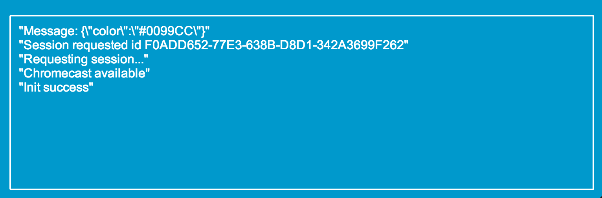
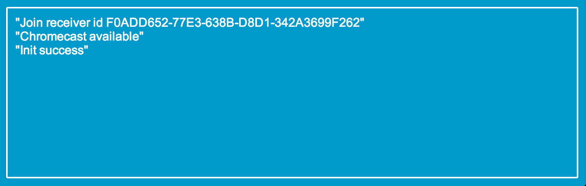





## Coding party

Ouvrez le fichier suivant dans votre IDE favori

    sender/js/app.js

Ce fichier contiendra tout le code nécessaire pour communiquer avec le serveur sur la chromecast.

### Configuration

Renseignez l'identifiant de l'application dans la variable <code>appId</code>

    var applicationID = '8D7FEAA1';
Pour communiquer avec la chromecast (échanger des messages), un namespace est nécessaire,
renseigner le namespace de l'application dans la variable <code>namespace</code>

    var namespace = 'urn:x-cast:fr.xebia.workshop.cast.maze';

### Initialisation

Ajouter l'API Chromecast à la page <code>index.html</code>

     <script type="text/javascript" src="https://www.gstatic.com/cv/js/sender/v1/cast_sender.js"></script>

Ecoutez l'événement <code>__onGCastApiAvailable</code> cf. [Initialization](https://developers.google.com/cast/docs/chrome_sender#Initialization),
cet événement necessite un callback prenant deux paramètres,
 si le premier paramètre est <code>true</code> alors exécutez la méthode

     initializeCastApi()
Sinon affichez une erreur.

La méthode <code>initializeCastApi()</code> permet d'initialiser l'API cf. [Initialization](https://developers.google.com/cast/docs/chrome_sender#Initialization)

Une fois le sender initialisé, la méthode <code>receiverListener(e)</code> permet de
connaître l'état de la chromecast cf. [Device Selection](https://developers.google.com/cast/docs/chrome_sender#Device_selection).

La méthode <code>sessionListener(e)</code> est appelée quand la session existe déjà côté receiver et que celle-ci est renvoyée au sender.
Elle permet de sauvegarder la session dans le cas ou le receiver connais déjà le sender (join).

Lancer le serveur NodeJS (racine du projet) :

    $ npm install
    $ node server.js

Affichez la page web :

    http://localhost:8080/sender/js/index.html

La page web s'affiche correctement et vous devriez voir le message :

    Chromecast available
    Init success

### Connection à la chromecast

Codez la fonction <code>launchApp()</code> pour connecter
votre navigateur à la chromecast cf. [Launch](https://developers.google.com/cast/docs/chrome_sender#Launch)

Affichez un message lorsque le navigateur est connecté cf. méthode <code>onRequestSessionSuccess(e)</code>

Sauvegardez la session dans la méthode ```onRequestSessionSuccess``` de la même façon que dans la méthode ```sessionListener```

Retournez sur la page web :

    http://localhost:8080/sender/js/index.html

Et vérifiez qu'en cliquant sur le bouton <code>Launch app</code> un nouveau joueur apparait bien sur
 l'écran connecté à la chromecast.

La page web s'affiche correctement et vous devriez voir le message :



Félicitation la connection à la chromecast est réussie ! Allons
jouer maintenant :)

Si vous rafraîchissez votre navigateur vous n'allez pas demander une nouvelle session mais vous allez vous connecter automatiquement et voir apparaître les messages :



### Communiquer avec la chromecast

Lorsque vous cliquez sur les boutons up, down, left, right la méthode <code>go(dir)</code> est appelée.

Faites en sorte d'envoyer un message à la chromecast cf. [session.sendMessage](https://developers.google.com/cast/docs/reference/chrome/chrome.cast.Session#sendMessage)

L'application sur la chromecast n'accepte que les messages :

    up
    down
    right
    left

Faites bouger votre joueur.

Félicitation ! Le joueur bouge ! Finissez le labyrinthe au plus vite :).

### Récupérer la couleur du joueur côté client

La chromecast peut aussi communiquer avec ses clients en utilisant des messages.

Pour cela il faut s'abonner a session à un ```listener``` cf. [addMessageListener](https://developers.google.com/cast/docs/reference/chrome/chrome.cast.Session#addMessageListener)

Attention, vous devez gérer le cas ou vous demandez une session et le cas ou vous avez déjà une session.

Essayez de récupérer la couleur du joueur après la demande de session ```onRequestSessionSuccess``` et après le join ```sessionListener```:

Cela se passe dans la méthode <code>onReceiverMessage(e)</code>, coder la conversion du paramètre en JSON et la vérification de l'existence du champ <code>color</code>

    e.color
Changez la couleur du fond par celle reçue :

    document.body.style.backgroundColor = obj.color;

Déconnectez-vous puis reconnectez-vous à nouveau, vérifiez que la couleur du fond a bien changé.

Bravo ! Vous avez réussi à recevoir des messages depuis la chromecast :).

### Go

Essayez de finir le labyrinthe !

